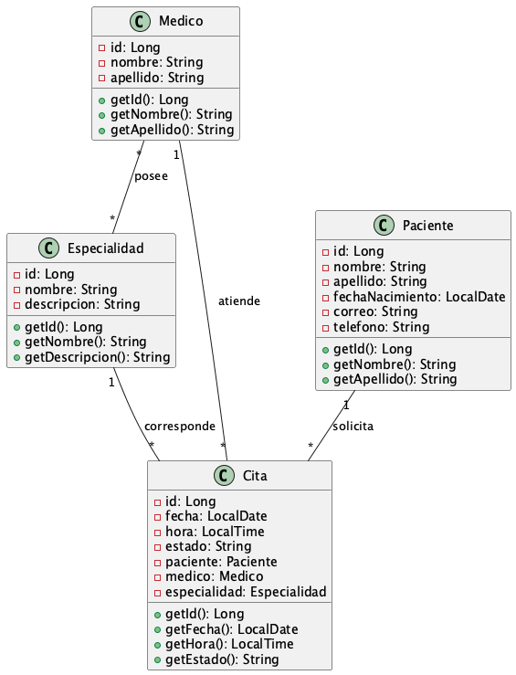
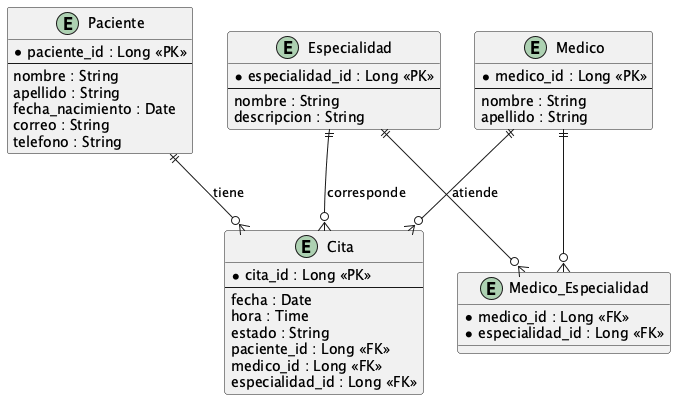
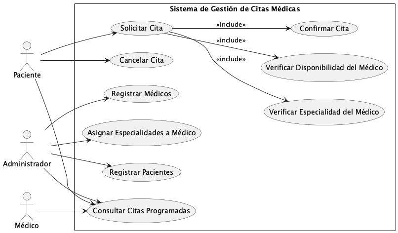

# API REST para Gestión de Citas Médicas

## Descripción del Proyecto

API RESTful desarrollada con Spring Boot para gestionar citas médicas entre pacientes y médicos. El sistema implementa validaciones de negocio complejas, manejo de relaciones entre entidades y una arquitectura profesional en capas.

Este proyecto corresponde al **Proyecto de Ciclo** de la asignatura **Programación Orientada a Objetos (POO)** - Ciclo II/2025 de la **Universidad de El Salvador – Facultad Multidisciplinaria de Occidente**.

---

## Equipo de Desarrollo

| Nombre | Carnet | Rol |
|--------|--------|-----|
| Jason Alexander Molina Ortiz | MO21016 | Coordinador / Backend Developer |
| Jose Manuel Mendoza Vasquez | MV24005 | Backend Developer |
| Vladimir Ernesto Reyes Zaldaña | RZ23001 | Backend Developer |
| Andrés Zavala Alvarado | ZA21010 | Backend Developer |
| José Ricardo González | GG22088 | Backend Developer |

---

## Características Principales

### Funcionalidades Implementadas

**Gestión de Especialidades Médicas**
- CRUD completo de especialidades
- Validación de nombres únicos
- Protección contra eliminación si tiene médicos asociados

**Gestión de Médicos**
- CRUD completo con múltiples especialidades (relación N:M)
- Validación de correos únicos
- Búsqueda por nombre
- Cálculo automático de cantidad de especialidades
- Campo calculado: lista de nombres de especialidades

**Gestión de Pacientes**
- CRUD completo de pacientes
- Cálculo automático de edad desde fecha de nacimiento
- Búsqueda por nombre o apellido (case-insensitive)
- Validación de correos únicos
- Protección contra eliminación si tiene citas asociadas

**Gestión de Citas Médicas (Módulo más complejo)**
- CRUD completo con 7 validaciones críticas de negocio:
    1. Verificar que el médico existe
    2. Verificar que el paciente existe
    3. Verificar que la especialidad existe
    4. Validar que el médico tiene esa especialidad
    5. Validar días hábiles (solo lunes a viernes)
    6. Validar horarios permitidos (8 slots, excluye 12:00-13:00)
    7. Verificar disponibilidad del médico (no doble reserva)
- Estados de cita con transiciones controladas (ENUM)
- Filtros por médico, paciente y estado
- Endpoint específico para cambiar solo el estado (PATCH)
- Timestamps automáticos (created_at, updated_at)

---

## Tecnologías Utilizadas

| Tecnología | Versión | Uso |
|------------|---------|-----|
| Java | 17+ | Lenguaje de programación |
| Spring Boot | 3.x | Framework principal |
| Spring Data JPA | 3.x | Persistencia de datos |
| Spring Validation | 3.x | Validaciones automáticas |
| Lombok | Latest | Reducción de código boilerplate |
| MySQL | 8.x | Base de datos |
| Maven | 3.x | Gestor de dependencias |
| JUnit 5 | 5.x | Pruebas unitarias |
| Mockito | 5.x | Framework de mocking para tests |
| Postman | Latest | Testing de endpoints |

---

## Estructura del Proyecto
```
gestioncitasmedicas/
├── src/
│   ├── main/
│   │   ├── java/com/api/gestioncitasmedicas/
│   │   │   ├── controller/          # Endpoints REST
│   │   │   ├── service/             # Lógica de negocio
│   │   │   ├── repository/          # Acceso a datos (JPA)
│   │   │   ├── entity/              # Entidades JPA
│   │   │   ├── dto/                 # Data Transfer Objects
│   │   │   └── exception/           # Manejo de excepciones
│   │   └── resources/
│   │       ├── application.properties
│   │       ├── db/
│   │       │   ├── schema.sql       # Estructura de tablas
│   │       │   └── data.sql         # Datos de prueba
│   └── test/java/                   # Pruebas unitarias
│       └── com/api/gestioncitasmedicas/
│           └── service/
│               ├── EspecialidadServiceTest.java
│               ├── PacienteServiceTest.java
│               ├── MedicoServiceTest.java
│               ├── MedicoEspecialidadServiceTest.java
│               └── CitaServiceTest.java
├── docs/
│   ├── uml/                         # Diagramas UML
│   │   ├── diagrama_clases.png
│   │   ├── diagrama_entidadRelacion.png
│   │   └── diagrama_casos.png
│   └── Gestión Citas Médicas API.postman_collection
├── pom.xml
└── README.md
```

---

## Modelo de Datos

### Entidades Principales

#### 1. Especialidad
```java
- id_especialidad (PK)
- nombre_especialidad (UNIQUE)
- descripcion
- created_at, updated_at
```

#### 2. Médico
```java
- id_medico (PK)
- nombre_medico
- apellido_medico
- telefono_medico (8 dígitos)
- correo_medico (UNIQUE, validado)
- created_at, updated_at
```

#### 3. Paciente
```java
- id_paciente (PK)
- nombre_paciente
- apellido_paciente
- fecha_nacimiento (cálculo automático de edad)
- telefono_paciente (8 dígitos)
- correo_paciente (UNIQUE, validado)
- created_at, updated_at
```

#### 4. Cita
```java
- id_cita (PK)
- fecha_cita (DATE, día hábil)
- hora_cita (TIME, validado)
- motivo_cita
- estado_cita (ENUM: PENDIENTE, CONFIRMADA, CANCELADA, COMPLETADA)
- id_paciente (FK)
- id_medico (FK)
- id_especialidad (FK)
- created_at, updated_at
```

#### 5. Medico_Especialidad (Tabla intermedia N:M)
```java
- id_medico_especialidad (PK)
- id_medico (FK)
- id_especialidad (FK)
```

### Relaciones
- **Médico - Especialidad:** N:M (un médico puede tener varias especialidades)
- **Médico - Cita:** 1:N (un médico tiene muchas citas)
- **Paciente - Cita:** 1:N (un paciente puede tener varias citas)
- **Especialidad - Cita:** 1:N (una especialidad se usa en muchas citas)

---

## API Endpoints

### Especialidades
```http
GET    /api/especialidades                          # Listar todas
GET    /api/especialidades/{id}                     # Obtener una
GET    /api/especialidades/buscar?nombre={nombre}   # Buscar por nombre
POST   /api/especialidades                          # Crear nueva
PUT    /api/especialidades/{id}                     # Actualizar
DELETE /api/especialidades/{id}                     # Eliminar
```

### Médicos
```http
GET    /api/medicos                         # Listar todos
GET    /api/medicos/{id}                    # Obtener uno
GET    /api/medicos/buscar?nombre={nombre}  # Buscar por nombre
GET    /api/medicos/{id}/especialidades     # Ver especialidades del médico
POST   /api/medicos                         # Crear nuevo
PUT    /api/medicos/{id}                    # Actualizar
DELETE /api/medicos/{id}                    # Eliminar
```

### Pacientes
```http
GET    /api/pacientes                           # Listar todos
GET    /api/pacientes/{id}                      # Obtener uno
GET    /api/pacientes/buscar?termino={termino}  # Buscar por nombre/apellido
POST   /api/pacientes                           # Crear nuevo
PUT    /api/pacientes/{id}                      # Actualizar
DELETE /api/pacientes/{id}                      # Eliminar
```

### Citas
```http
GET    /api/citas                       # Listar todas
GET    /api/citas/{id}                  # Obtener una
GET    /api/citas?medico={id}           # Filtrar por médico
GET    /api/citas?paciente={id}         # Filtrar por paciente
GET    /api/citas?estado={estado}       # Filtrar por estado
POST   /api/citas                       # Crear cita (con validaciones)
PUT    /api/citas/{id}                  # Actualizar cita
PATCH  /api/citas/{id}/estado           # Cambiar solo el estado
DELETE /api/citas/{id}                  # Eliminar cita
```

---

## Validaciones Implementadas

### Validaciones de Datos (Anotaciones Jakarta)
- `@NotNull`, `@NotBlank` - Campos obligatorios
- `@Email` - Formato de correo válido
- `@Pattern` - Teléfono de 8 dígitos exactos
- `@Past` - Fecha de nacimiento en el pasado
- `@FutureOrPresent` - Fecha de cita presente o futura
- `@Size` - Longitud de cadenas

### Validaciones de Negocio (Citas)
1. **Días hábiles:** Solo lunes a viernes
2. **Horarios permitidos:** 08:00, 09:00, 10:00, 11:00, 13:00, 14:00, 15:00, 16:00
3. **Hora de almuerzo bloqueada:** 12:00-13:00 NO disponible
4. **Disponibilidad del médico:** No permite doble reserva
5. **Especialidad del médico:** Verifica relación en tabla intermedia
6. **Estados finales:** COMPLETADA y CANCELADA no se pueden modificar

### Horarios de Atención
```
Lunes a Viernes: 08:00 - 17:00
Hora de almuerzo: 12:00 - 13:00 (NO disponible)
Duración por cita: 1 hora
Slots disponibles: 8 citas por día por médico
```

---

## Casos de Uso Principales

### 1. Registrar Médico
- **Actor:** Administrador
- **Flujo:** Registra médico y asigna especialidades

### 2. Registrar Paciente
- **Actor:** Administrador
- **Flujo:** Registra datos del paciente con cálculo automático de edad

### 3. Agendar Cita Médica
- **Actor:** Paciente
- **Flujo:**
    1. Selecciona médico, especialidad, fecha y hora
    2. Sistema valida:
        - Médico tiene la especialidad
        - Fecha es día hábil
        - Hora es válida
        - Médico está disponible
    3. Si todo es correcto, crea cita con estado PENDIENTE

### 4. Cambiar Estado de Cita
- **Actor:** Administrador/Médico
- **Flujo:**
    - PENDIENTE a CONFIRMADA
    - CONFIRMADA a COMPLETADA
    - CONFIRMADA a CANCELADA
    - No permite cambios desde COMPLETADA o CANCELADA

### 5. Consultar Agenda
- **Médico:** Ve sus citas filtradas por su ID
- **Paciente:** Ve sus citas filtradas por su ID
- **Administrador:** Ve todas las citas con filtros opcionales

---

## Cómo Ejecutar el Proyecto

### Requisitos Previos
- **Java 17+** - [Descargar](https://adoptium.net/)
- **Maven 3.6+** - [Descargar](https://maven.apache.org/)
- **MySQL 8.x** - [Descargar](https://dev.mysql.com/downloads/)
- **IDE recomendado:** IntelliJ IDEA

### Pasos de Instalación

#### 1. Clonar el repositorio
```bash
git clone https://github.com/usuario/gestioncitasmedicas.git
cd gestioncitasmedicas
```

#### 2. Configurar la base de datos

**En MySQL Workbench, ejecutar EN ORDEN:**
```bash
# 1. Crear estructura de tablas
mysql> source src/main/resources/db/schema.sql;

# 2. Insertar datos de prueba
mysql> source src/main/resources/db/data.sql;
```

#### 3. Configurar application.properties
```properties
spring.datasource.url=jdbc:mysql://localhost:3306/gestion_citas_medicas
spring.datasource.username=tu_usuario
spring.datasource.password=tu_contraseña

spring.jpa.hibernate.ddl-auto=none
spring.jpa.show-sql=true
spring.jpa.properties.hibernate.format_sql=true
```

#### 4. Compilar y ejecutar
```bash
# Limpiar y compilar
mvn clean install

# Ejecutar la aplicación
mvn spring-boot:run
```

#### 5. Acceder a la API
```
Base URL: http://localhost:8080
```

---

## Testing con Postman

### Importar Colección
1. Abrir Postman
2. Importar colección desde `/docs/`
3. Configurar variable de entorno:
    - `base_url` = `http://localhost:8080`
    - `api_path` = `/api`

### Ejemplos de Requests

#### Crear Especialidad
```http
POST http://localhost:8080/api/especialidades
Content-Type: application/json

{
  "nombreEspecialidad": "Cardiología",
  "descripcion": "Especialidad del corazón"
}
```

#### Crear Médico
```http
POST http://localhost:8080/api/medicos
Content-Type: application/json

{
  "nombreMedico": "Carlos",
  "apellidoMedico": "Rodríguez",
  "telefonoMedico": "77001234",
  "correoMedico": "carlos.rodriguez@hospital.com",
  "idsEspecialidades": [1, 9]
}
```

#### Crear Cita (con validaciones)
```http
POST http://localhost:8080/api/citas
Content-Type: application/json

{
  "idPaciente": 1,
  "idMedico": 1,
  "idEspecialidad": 1,
  "fechaCita": "2025-11-25",
  "horaCita": "09:00:00",
  "motivoCita": "Chequeo cardiológico"
}
```

#### Cambiar Estado de Cita
```http
PATCH http://localhost:8080/api/citas/1/estado
Content-Type: application/json

{
  "nuevoEstado": "CONFIRMADA"
}
```

---

## Pruebas Unitarias

El proyecto incluye una suite completa de **60 pruebas unitarias** implementadas con **JUnit 5** y **Mockito**, garantizando la calidad y confiabilidad del código.

### Cobertura de Pruebas

#### **EspecialidadServiceTest** (8 tests)
- CRUD completo (listar, obtener, crear, actualizar, eliminar)
- Validación de nombres duplicados
- Protección de eliminación con médicos asociados

#### **PacienteServiceTest** (12 tests)
- CRUD completo
- Validación de correos duplicados al crear y actualizar
- Cálculo automático de edad
- Búsqueda por nombre o apellido (case-insensitive)
- Protección de eliminación con citas asociadas
- Casos de borde (fecha de nacimiento nula)

#### **MedicoServiceTest** (12 tests)
- CRUD completo
- Gestión de relaciones N:M con especialidades
- Validación de correos duplicados
- Obtención de especialidades de un médico
- Protección de eliminación con citas asociadas
- Eliminación en cascada de relaciones médico-especialidad

#### **MedicoEspecialidadServiceTest** (6 tests)
- Asignación de especialidades a médicos
- Validación de médico y especialidad existentes
- Protección contra relaciones duplicadas
- Desasignación de especialidades
- Validación de relación existente antes de eliminar

#### **CitaServiceTest** (22 tests) - El más completo
**CRUD Básico:**
- Listar todas las citas
- Obtener cita por ID
- Crear, actualizar y eliminar citas

**Validaciones de Negocio (7 validaciones críticas):**
- Verificación de existencia de paciente
- Verificación de existencia de médico
- Verificación de existencia de especialidad
- Validación de especialidad del médico
- Validación de días hábiles (rechazo de sábados y domingos)
- Validación de horarios permitidos (8 slots, rechazo de hora de almuerzo)
- Validación de disponibilidad del médico

**Estados y Transiciones:**
- Cambio de estado PENDIENTE → CONFIRMADA
- Cambio de estado CONFIRMADA → COMPLETADA
- Rechazo de transiciones inválidas

**Filtros:**
- Filtrado por médico
- Filtrado por paciente
- Filtrado por estado

### Tecnologías de Testing

- **JUnit 5 (Jupiter):** Framework de pruebas unitarias
- **Mockito:** Framework para crear mocks de dependencias
- **@Mock:** Simula repositorios sin acceder a la base de datos
- **@InjectMocks:** Inyecta mocks en el servicio bajo prueba
- **@BeforeEach:** Inicializa datos de prueba antes de cada test

### Patrón AAA (Arrange-Act-Assert)

Todas las pruebas siguen el patrón estándar:
```java
@Test
void testCrearCita() {
    // ARRANGE: Preparar datos y configurar mocks
    when(medicoRepository.findById(1L)).thenReturn(Optional.of(medico));
    
    // ACT: Ejecutar el método a probar
    CitaDTO resultado = citaService.crear(crearDTO);
    
    // ASSERT: Verificar el resultado
    assertNotNull(resultado);
    assertEquals("PENDIENTE", resultado.getEstadoCita());
    verify(citaRepository, times(1)).save(any(Cita.class));
}
```

### Ejecutar las Pruebas
```bash
# Ejecutar todas las pruebas
mvn test

# Ejecutar pruebas de un servicio específico
mvn test -Dtest=CitaServiceTest

# Generar reporte de cobertura
mvn clean test jacoco:report
```

### Resultados Esperados
```
Tests run: 60, Failures: 0, Errors: 0, Skipped: 0

[INFO] ------------------------------------------------------------------------
[INFO] BUILD SUCCESS
[INFO] ------------------------------------------------------------------------
```

### Beneficios de las Pruebas Unitarias

1. **Confiabilidad:** Garantiza que la lógica de negocio funciona correctamente
2. **Detección temprana:** Encuentra errores antes de producción
3. **Documentación viva:** Las pruebas sirven como ejemplos de uso
4. **Refactoring seguro:** Permite cambiar código con confianza
5. **Calidad del código:** Fomenta diseño modular y desacoplado

---

## Datos de Prueba

La base de datos incluye:
- **10 especialidades** médicas
- **12 médicos** con múltiples especialidades
- **15 pacientes** con edades calculadas
- **20 citas** de ejemplo en diferentes estados

---

## Arquitectura del Sistema

### Patrón: Arquitectura en Capas
```
┌─────────────────────┐
│   CONTROLLER        │  ← Endpoints REST (recibe HTTP)
│   @RestController   │
└──────────┬──────────┘
           │
           ▼
┌─────────────────────┐
│   SERVICE           │  ← Lógica de negocio
│   @Service          │  ← Validaciones
└──────────┬──────────┘
           │
           ▼
┌─────────────────────┐
│   REPOSITORY        │  ← Acceso a datos
│   @Repository       │  ← Queries JPA
└──────────┬──────────┘
           │
           ▼
┌─────────────────────┐
│   DATABASE          │  ← MySQL
│   (MySQL)           │
└─────────────────────┘
```

### Flujo de una Request
```
1. Cliente (Postman) hace POST /api/citas
2. CitaController recibe request
3. Valida datos con @Valid
4. CitaService ejecuta lógica:
   - Verifica médico existe
   - Verifica paciente existe
   - Valida especialidad del médico
   - Valida día hábil
   - Valida horario
   - Verifica disponibilidad
5. CitaRepository guarda en BD
6. Retorna CitaDTO al cliente
```

---

## Patrones de Diseño Implementados

1. **DTO Pattern** - Separación entre entidades y DTOs
2. **Repository Pattern** - Abstracción del acceso a datos
3. **Service Layer Pattern** - Lógica de negocio centralizada
4. **Dependency Injection** - Inyección de dependencias con `@RequiredArgsConstructor`
5. **Builder Pattern** - Uso de Lombok para construcción de objetos
6. **Strategy Pattern** - Validaciones modulares en services

---

## Características Técnicas Avanzadas

### Campos Calculados
- **Edad del paciente:** Calculada automáticamente desde `fecha_nacimiento`
- **Cantidad de especialidades:** Conteo automático para médicos
- **Lista de especialidades:** Nombres extraídos de relación N:M

### Queries Personalizadas
```java
@Query("SELECT c FROM Cita c WHERE c.medico.idMedico = :idMedico " +
       "AND c.fechaCita = :fecha AND c.horaCita = :hora " +
       "AND c.estadoCita != 'CANCELADA'")
Optional<Cita> findByMedicoAndFechaAndHora(...);
```

### Naming Conventions (Spring Data JPA)
```java
List<Paciente> findByNombrePacienteContainingIgnoreCaseOrApellidoPacienteContainingIgnoreCase(
    String nombre, String apellido
);
```

### Timestamps Automáticos
```java
@PrePersist
protected void onCreate() {
    createdAt = LocalDateTime.now();
    updatedAt = LocalDateTime.now();
}

@PreUpdate
protected void onUpdate() {
    updatedAt = LocalDateTime.now();
}
```

---

## Manejo de Errores

### GlobalExceptionHandler
```java
@RestControllerAdvice
public class GlobalExceptionHandler {
    // Captura RuntimeException
    // Captura errores de validación (@Valid)
    // Formatea respuestas con timestamp, status y message
}
```

### Ejemplo de Respuesta de Error
```json
{
  "timestamp": "2025-11-24T18:30:00",
  "status": 400,
  "error": "Error de negocio",
  "message": "El médico ya tiene una cita agendada el 2025-11-25 a las 09:00"
}
```

---

## Documentación Adicional

### Diagramas UML

#### Diagrama de Clases


Representa las entidades y sus relaciones:
- Paciente, Médico, Especialidad, Cita
- Relación N:M entre Médico y Especialidad

#### Diagrama Entidad-Relación


Muestra la estructura de la base de datos con:
- Tablas principales
- Tabla intermedia `medico_especialidad`
- Llaves foráneas (FK)

#### Diagrama de Casos de Uso


Interacciones de actores con el sistema:
- Administrador: CRUD completo
- Paciente: Solicitar y consultar citas
- Médico: Ver agenda

---

## Licencia

Este proyecto es de carácter **académico** y fue desarrollado con fines **educativos** en la asignatura **Programación Orientada a Objetos - Ciclo II/2025** de la **Universidad de El Salvador – Facultad Multidisciplinaria de Occidente**.

---

